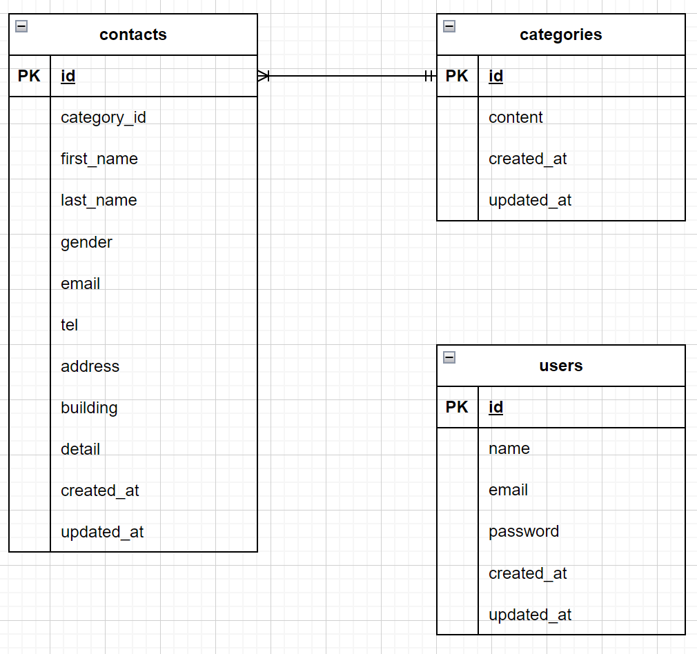

＃お問い合わせフォーム

＃環境構築
1．リポジトリ作成
2．作業ディレクトリ作成
3．docker-compose up -d --build
4．docker-compose exec php bash
5．composer create-project "laravel/laravel=8.*" . --prefer-dist
6．時間設定編集
7．データベースの確認
　　docker-compose exec mysql bash
   mysql -u laravel_user -p
   SHOW DATABASES;
8．データベースの接続
　　.envファイルの編集
9．php artisan migrate
10．php artisan db:seed

＃使用技術
・php 8
・Laravel 8
・MySQL 8

＃URL
・開発環境：http://localhost/
・phpMyAdmin: http://localhost:8080/

＃ER図
